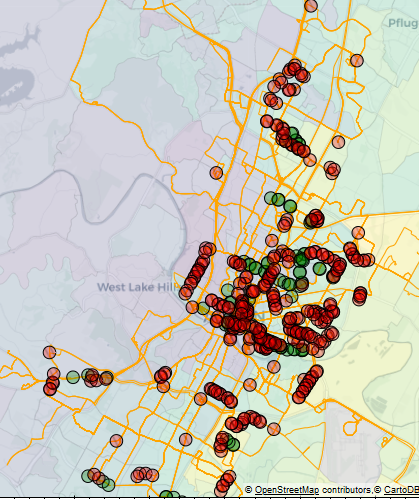

# CapRemap: Transit Equity Analysis

## Description
To view code, problem description, and *interactive plots*, check out [https://cnyahia.github.io/transit-equity-remap/](https://cnyahia.github.io/transit-equity-remap/).
For more discussion on this analysis check out [this blog post](https://cesnyah.medium.com/equity-in-transit-planning-are-we-using-the-right-metrics-230d6c741d8c)

This repository includes equity analysis for CapMetro's restructuring of its transit system in 2018. CapRemap was controversial-- many activists claim that it had a disproportionately adverse impact on minorities.

CapMetro claims that the benefits to minorities far exceeds the negative impact; however, an initial look at CapMetro's service equity analysis (FTA's SAFE analysis) shows that the analysis approach has several limitations:
1. A detailed analysis of changes to the service frequency is lacking
2. A route-level approach is used where a 1/2 mile walk-shed represents the network coverage. While route-level walk-sheds are commonly used, stop-based coverage with buffers of a 1/4 mile radius seems more 
appropriate since customers walk to bus stops (not routes).
3. The routes analyzed were restricted to those that had a greater than 25% change in geographic coverage or service characteristics, where this 25% threshold was set by CapMetro. 
Even after selecting the routes with major changes, they were only analyzed further if the % minority population in the walk-shed was greater than 35%. 
It is not clear if this excludes from the analysis parts of the network that were negatively impacted.
4. CapMetro's method depends on the irregular shapes of census block groups to determine the network coverage, and a block group is assumed to be covered if any part of it overlaps with a route walk-shed. Evidently, the 
network coverage should be restricted to demographics *within* the area of 1/4 mile buffers around stops.

To address those limitations, an alternative stop-level equity analysis is developed. This stop-level analysis maps the demographic characteristics from census-tracts to stop buffers, where the area of intersection between 
the census tracts and the buffers is used to weight the contribution of each tract. Then, for each stop, the change in morning peak service is analyzed. The network level impact on minorities is then measured using stop-level metrics.

The results indicate that CapRemap did not significantly improve service throughout the network. In fact, for all demographics, there was a decrease in the expected number of buses passing during the morning peak. 
Although CapMetro provided a *high frequency network* with improved service on specific routes, these improvements were at the expense of other non-frequent lines. That said, in contrast to activists' claims, there is no clear 
indication that minorities experienced greater service reductions. Minority areas were allotted 55% of the total service improvements (doors opening) and they received 52% of the total service reductions. Meanwhile, areas with 
White people were allotted 45% of the total service improvements and they received 47% of the total service reductions. These results show that minority areas did not simultaneously receive a lower fraction of the service improvements and a 
greater fraction of the service reductions, which indicates that there is no apparent bias against minorities in the distribution of service modifications. 

## Files

* `equity.ipynb`: notebook with full equity and data analysis
* `utils.py`: utility functions that support the analysis in `equity.ipynb`
* `index.html`: an HTML file that renders interactive plots and code given in `equity.ipynb`